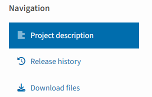

# CFRAFN: A Deep Learning Model for Depression Recognition Based on Attention Mechanism and Integrated Mixed Features
Cross-Feature Residual Attention Fusion Network (CFRAFN), which leverages eGeMAPS features along with high-dimensional embeddings extracted from the pre-trained VGGish model to effectively capture depression-associated phonetic patterns. Specifically, the CFRAFN utilizes differentiated residual blocks to maintain training stability in deep hierarchical structure. Furthermore, the self-attention fusion strategy dynamically weights the significance of each feature modality, ensuring effective feature integration and consequently improving depression prediction accuracy.

## Set up

### Requirement
The project was developed using Python 3.12.8. The following library packages are essential for its execution:
```txt
librosa==0.10.2.post1
matplotlib==3.10.3
numpy==2.2.5
opensmile==2.5.1
pandas==2.2.3
scipy==1.15.3
seaborn==0.13.2
torch==2.5.1
```
We tested these packages on the Windows operating system to ensure that they can be installed and used correctly.

### Installation

All the installation packages are listed in the `requirements.txt` file.

For the installation of the necessary packages, please follow the steps below:
```shell
chmod +x install_deps.sh
./install_deps.sh
```

## Demo
Subject to the requirements of patient privacy protection and confidentiality agreements, the data of this study are not publicly stored on the GitHub platform. If you need to use the CFRAFN model to predict patient audio files, it is recommended to process the files according to the audio preprocessing process described in this research paper. Specifically, it includes steps such as Mono Conversion, Resampling to 16kHz, Amplitude Normalization, and Silence Removal.

### CFRAFN Model Train and Evaluate

usage: main.py [-h] [--data_path DATA_PATH] [--save_path SAVE_PATH] [--model_save_name MODEL_SAVE_NAME]
example:
```shell
cd code
python main.py --data_path /path/to/your/data --save_path /path/to/save/results --model_save_name /path/to/model/model_name
```
options:
-  `-h, --help`            show this help message and exit
-  `--data_path DATA_PATH`
                        Path to the input data directory
-  `--save_path SAVE_PATH`
                        Path to save the results and model
-  `--model_save_name MODEL_SAVE_NAME`
                        Filename for saving the best model

The training and evaluation process of the model is time-consuming and has high requirements for hardware computing resources. Taking the experimental environment as an example, based on the NVIDIA RTX 4090 GPU, it takes a total of 40 minutes to complete one round of training and evaluation process on a dataset containing approximately 300 audio samples.

## Common questions
1. During the process of loading and using the VGGish model, the following problems occurred: the model could not be loaded correctly, and the system prompted a lack of torchvggish - related dependencies.
Users need to retrieve torchvggish through the Python Package Index (PyPI) and download it to the local environment for compilation and installation.



